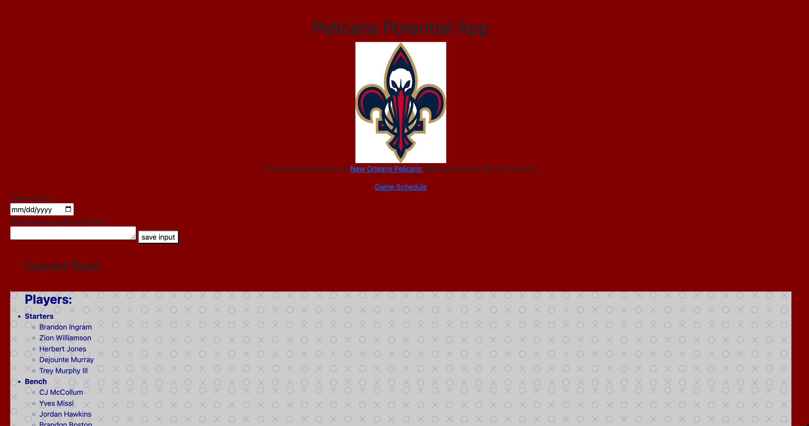
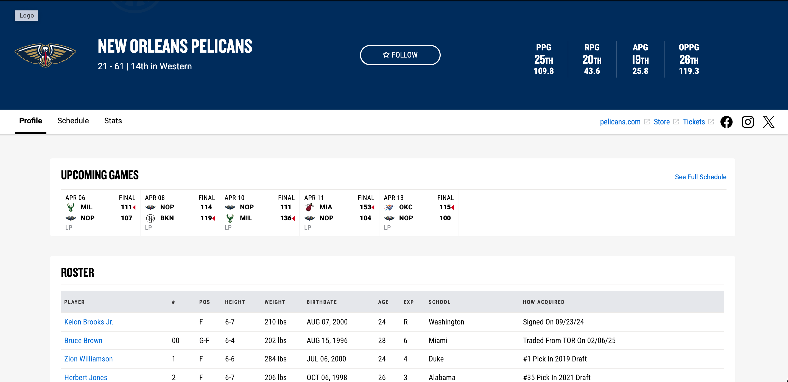

# dev-george

# Pelicans Potential App - Revamped

## Authorship
Victor Love
GitHub Profile: [Your GitHub Profile URL](https://github.com/VicLove25)

## Attribution
https://www.w3schools.com/js/js_json_intro.asp (All of json in general)
https://github.com/barrycumbie/jubilant-garbanzo-easy-read
https://github.com/VicLove25/dev-charlie
https://developer.mozilla.org/en-US/docs/Web/JavaScript/Guide/Working_with_objects
https://www.w3schools.com/cssref/css_colors.php

## User Story
Unfortunately, as a previous New Orleans Pelicans fan, I wanted to keep track of the current roster, game schedule, staff, etc. So I created an app that did so! Sadly, I'm not a Pels fan anymore because they traded BRANDON INGRAM!!

## Narrative
Although unfinished, this app is a remodeled and significantly better previous project(dev-able), using all the material I've learned so far and some. My Pelicans fan status is still up in the air but this app is for myself 6 months before the trade :(. The app is able to Add Players, save them to the team, and allows you to get minimal information about the pelicans. (Side note: The first save input button doesn't work is a pun to the orignial dev-able :D)

### Development Story
It took me a long time to develop this app, and there's still things I want to add! The hardest part was getting the buttons to work and reformatting the colors on the app. Bootstrap also played a huge part in the app revamp. It made the app look a lot cleaner compared to before. Overall, I feel like the app is still a work in progress and I want to continue to add and make it my best project to date. 

### Original Able App:

### This is what I want my app to look similar to:

